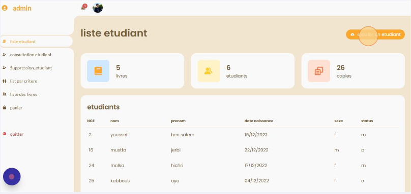

# Bookly - Online Library Management System

<div align="center">
  
  
  
</div>

## 📚 Overview

Bookly is a modern, responsive online library management system designed to help academic institutions efficiently manage their book inventory and student borrowing processes. Originally developed as a university project, this application provides separate interfaces for students and administrators, with features for browsing books, managing borrowing, and keeping track of inventory.

## ✨ Features

### For Students
- **User Authentication**: Secure login with student ID (NCE)
- **Book Browsing**: View complete catalog of available books with details
- **Shopping Cart**: Add up to 3 books to a personal borrowing cart
- **Account Management**: View personal borrowing history and status
- **Real-time Availability**: See which books are currently available for borrowing
- **Confirmation System**: Easy checkout process with success notifications

### For Administrators
- **Dashboard**: Overview statistics of books, students, and copies
- **Book Management**: Add, edit, and remove books from the inventory
- **Student Management**: Register new students and manage existing records
- **Borrowing Oversight**: Track which students have borrowed which books
- **Inventory Control**: Keep track of book quantities and availability status

## 🛠️ Technologies Used

- **Frontend**:
  - HTML5
  - CSS3
  - JavaScript
  - jQuery
  - Boxicons (icon library)
  - SweetAlert (for elegant user notifications)

- **Backend**:
  - PHP
  - MySQL database

- **Architecture**:
  - MVC-inspired pattern with separation of concerns
  - Responsive design that works on all device sizes

## 📂 Project Structure

```
bookly/
├── css/                  # CSS stylesheets
├── img/                  # Images and icons
├── images/               # Additional image resources
├── js/                   # JavaScript files
│   └── sweetalert.min.js # Notification library
├── livre/                # Book-related resources
├── main/                 # Main entry point files
│   └── main.php          # Landing page
├── php/                  # PHP backend files
│   ├── confirmer.php     # Checkout confirmation
│   ├── deleteE.php       # Delete student function
│   ├── deleteL.php       # Delete book function
│   ├── deleteP.php       # Remove from cart function
│   ├── insc.php          # Registration handler
│   └── searchE.php       # Student search function
├── update/               # Update record handlers
├── ajoutPanier.php       # Add to cart functionality
├── bookly.php            # Main student interface
├── connect.php           # Authentication handler
├── dashboard.php         # Admin dashboard
├── inscrit.php           # Registration page
├── script.js             # Main JavaScript functionality
└── style.css             # Main stylesheet
```

## 🚀 Installation

1. **Prerequisites**:
   - PHP 7.0 or higher
   - MySQL 5.6 or higher
   - Web server (Apache/Nginx)

2. **Setup**:
   ```bash
   # Clone the repository
   git clone https://github.com/yourusername/bookly.git
   
   # Import database structure
   # Create a MySQL database named 'biblio_projet_php'
   # Import the database structure (SQL file not included, create based on codebase)
   
   # Configure database connection
   # Edit connect.php with your database credentials if needed
   
   # Start your web server and navigate to the installation
   ```

3. **Default Access**:
   - Admin access: Use "admin123" as the NCE (ID)
   - Student access: Register a new account or use an existing student ID

## 💻 Usage

📘 [Step-by-Step User Guide](bookly.pdf)

### Student Flow
1. Visit the landing page and log in with your student ID
2. Browse available books in the catalog
3. Add up to 3 books to your cart
4. Review your selections in the cart
5. Confirm checkout to borrow books

### Administrator Flow
1. Log in using the admin credentials
2. Use the dashboard to get an overview of the library status
3. Manage books: add new titles, update information, or remove old entries
4. Manage students: register new students or update existing records
5. Monitor borrowing activities and book availability

## 🔒 Security Features

- Password-free authentication using student ID numbers
- Session management to prevent unauthorized access
- Input validation to prevent SQL injection
- Proper error handling and user feedback

## 🔄 Database Structure

The application uses several key tables:
- `etudiants`: Stores student information
- `livres`: Contains all book details and inventory
- `panier`: Manages the shopping cart system
- Other supporting tables for relationships and metadata


## 📄 License

This project is licensed under the MIT License - see the LICENSE file for details.


Developed with ❤️ for efficient library management. 